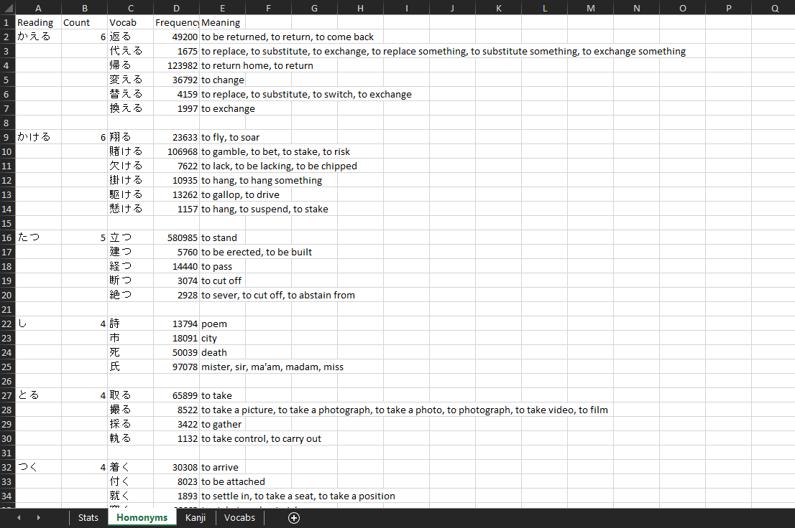

# WK.Info

Collects and aggregates data based on your [WaniKani](https://www.wanikani.com) level, and various dictionary resources. By default, outputs info to an excel file.

## Usage

WK.Info uses environment variables for some of the sensitive required data:

- `WK_INFO_API_KEY`: Your WK api key. Make sure to set this to your own api key, you can find it at https://www.wanikani.com/settings/account.

Then compile and run, an excel file called "WK.Info.xlsx" will be written to your desktop.

## Credit

- JMdict: http://www.edrdg.org/enamdict/enamdict_doc.html
- KANJIDIC: http://nihongo.monash.edu/kanjidic2/index.html
- Innocent Corpus: https://forum.koohii.com/post-168613.html#pid168613
